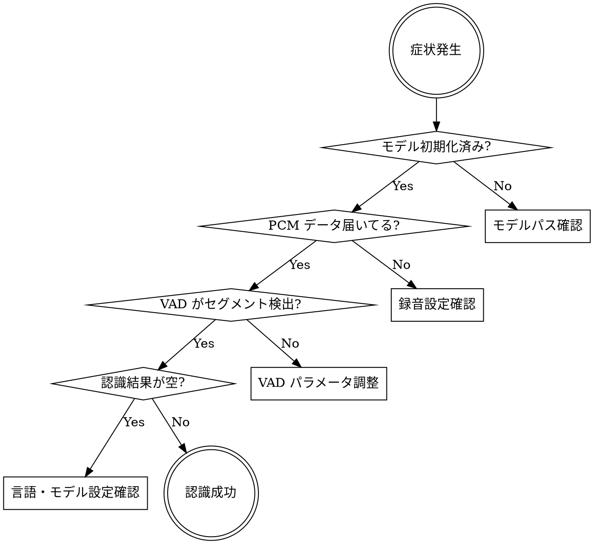

# Audio Pipeline Debug

## Overview

koememo の音声パイプライン（録音 → PCM 変換 → VAD → 認識）のデバッグガイド。問題は必ずパイプラインの上流から切り分ける。

**IMPORTANT:** sherpa_onnx の設定値・実装パターンは `sherpa-onnx-flutter-guide.md` を参照すること。

## When to Use

- 文字起こし結果が空・おかしい
- 録音が無音になる
- モデルの初期化に失敗する
- アプリがクラッシュする（sherpa_onnx 関連）
- VAD が発話を検出しない / 過剰に検出する

## Diagnosis Flow

## Checkpoint Checklist

### 1. モデル初期化

| チェック項目 | 確認方法 |
|------------|---------|
| model.int8.onnx が Documents に存在 | `ModelManager.ensureModelReady()` のパスを print |
| tokens.txt が Documents に存在 | 同上 |
| OfflineRecognizer が生成される | `_isInitialized == true` を確認 |
| Android で onnx が壊れていない | `aaptOptions { noCompress 'onnx' }` 確認 |

### 2. 録音・PCM

| チェック項目 | 確認方法 |
|------------|---------|
| マイク permission が許可済み | `_recorder.hasPermission()` |
| sampleRate = 16000 | RecordConfig を確認 |
| numChannels = 1 | RecordConfig を確認 |
| encoder = pcm16bits | RecordConfig を確認 |
| Float32 変換が正しい | 値の範囲が -1.0〜1.0 であること |

### 3. VAD

| 症状 | 原因と対策 |
|------|-----------|
| 発話を検出しない | threshold を下げる (0.5 → 0.3) |
| ノイズで誤検出 | threshold を上げる (0.5 → 0.7) |
| セグメントが細切れ | minSilenceDuration を上げる (0.5 → 1.0) |
| 長い発話が切れる | maxSpeechDuration を上げる (30 → 60) |

### 4. 認識

| 症状 | 原因と対策 |
|------|-----------|
| 結果が空文字 | セグメントの samples が空でないか確認 |
| 認識精度が低い | `language: 'ja'` の明示指定を確認 |
| 数字が漢数字 | `useInverseTextNormalization: true` を確認 |
| stream リーク | `stream.free()` が呼ばれているか確認 |

## Memory Concerns

- SenseVoice int8 ランタイム: 約 300〜400MB
- 録音停止後は VAD を reset、不要な stream を free
- バックグラウンド時は認識を一時停止する設計が望ましい
